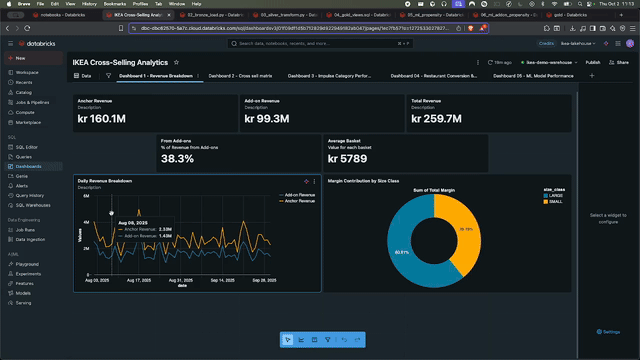
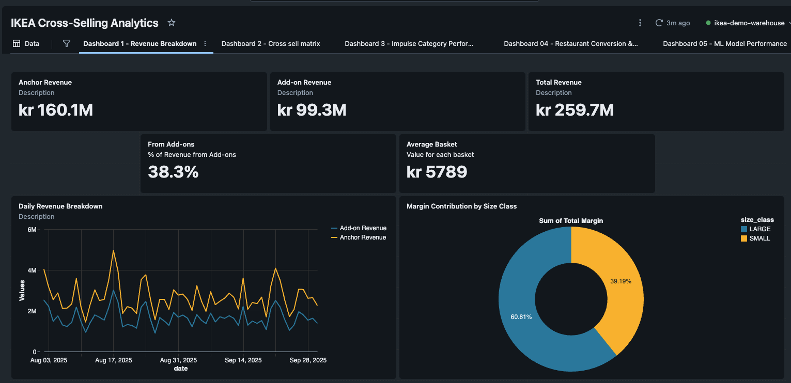
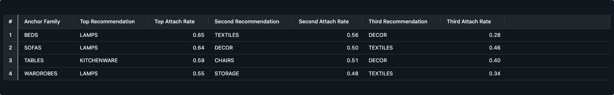

# IKEA Cross-Selling Analytics Demo

**Goal**: Demonstrate how large "anchor" purchases (sofas, beds) drive attach of small add-ons and restaurant visits the same day - **IKEA's real profit engine**.

This is a complete end-to-end Lakehouse demo showcasing modern data engineering practices for retail analytics.



##  Business Context

In IKEA's business model, **cross-selling is the primary revenue driver**:
- Customers come to buy big-ticket items (anchors)
- They leave with many small impulse items (add-ons) - **this is where the profit is**
- Tired shoppers eat at the restaurant after shopping
- Understanding and optimizing this behavior is critical for profitability

This demo uses **synthetic data biased toward real IKEA patterns**:
- 35% of visits include an anchor purchase (large furniture)
- 95% of anchor customers buy 2-5+ add-on items
- 50% of anchor customers visit the restaurant (vs 14% baseline)
- Impulse categories (DECOR, KITCHENWARE, LAMPS) show strong attachment

---

## 🔧 Separate Demo: Advanced Data Engineering Patterns

**This repository includes a SECOND, independent demo** showcasing production-ready data engineering patterns using external APIs (DummyJSON, Frankfurter). This is **not related to the IKEA business case** - it's a technical demonstration of Databricks capabilities.

### What's Included

This demo covers:
- **API Integration**: REST API ingestion with retry logic and pagination
- **Metadata-Driven Joins**: YAML-based configuration for scalable join pipelines
- **Delta Governance**: Time travel, audit trails, and rollback patterns
- **Performance Tuning**: Skew mitigation and broadcast optimization with measurable results
- **BI Engineering**: Dashboard queries that visualize technical metrics (not just business KPIs)
- **Testing**: Unit tests with pytest, schema validation, and data quality checks

### How to Run (Step-by-Step)

Run these notebooks **after completing the IKEA demo** (or independently):

1. **API Testing** (Optional): Import `ops/postman_collection.json` into Postman to test API endpoints
2. **API Ingestion**: Run `notebooks/07_ingest_api_data.py` - fetches data from DummyJSON and Frankfurter APIs
3. **API Transformation**: Run `notebooks/08_silver_api_transform.sql` - transforms API data into silver layer
4. **Metadata Joins**: Run `notebooks/09_metadata_joins.py` - demonstrates YAML-driven join pipeline
5. **Delta Governance**: Run `notebooks/10_delta_time_travel.py` - time travel and audit trail examples
6. **Performance Tuning**: Run `notebooks/11_perf_skew_broadcast_ENHANCED.py` - skew detection and optimization
7. **BI Engineering**: Execute queries from `notebooks/12_bi_concepts_demo.sql` in Databricks SQL
8. **Lineage Diagram**: Run `notebooks/13_generate_join_diagram.py` - generates Mermaid diagrams from YAML config

### Testing (Local Development)

```bash
cd tests/
pip install -r ../requirements.txt
pytest test_transforms.py -v --cov=. --cov-report=term-missing
```

**13 unit tests** covering FX rates, product transformations, customer enrichment, and metadata-driven joins.

---

##  What You Get (IKEA Demo)

1. **Synthetic datasets** for 60 days of activity for a single store
2. **PySpark notebooks** for Bronze → Silver → Gold (Lakehouse pattern)
3. **Two ML models** tracked with MLflow:
   - Restaurant propensity (predict who will eat)
   - Add-on category recommendations (predict which categories to promote)
4. **dbt models and tests** for data quality on key tables
5. **Five dashboard query sets** for Databricks SQL:
   - Revenue breakdown (shows add-ons drive profit)
   - Cross-sell matrix (anchor × add-on lift scores)
   - Impulse category performance (checkout zone items)
   - Restaurant conversion and upsell
   - ML model performance metrics

##  Quickstart on Databricks (IKEA Demo)

### Step 1: Generate Data
1. Create a new Repo and upload the contents of this project
2. In a cluster with **DBR 14.x+** and **Python 3.10**, open `notebooks/01_generate_synth_data.py` and run all cells
   - Creates CSV files in `data_seed/` with realistic cross-selling patterns

### Step 2: Build Lakehouse
3. Run `notebooks/02_bronze_load.py` to load CSV → Delta (bronze schema)
4. Run `notebooks/03_silver_transform.py` to clean and model baskets
5. Run `notebooks/04_gold_views.sql` in a SQL editor to create views used by dashboards

### Step 3: Train ML Models (Optional)
6. Run `notebooks/05_ml_propensity.py` to train restaurant propensity model (Random Forest, logged to MLflow)
7. Run `notebooks/06_ml_addon_propensity.py` to train add-on category models (logged to MLflow)

### Step 4: Create Dashboards
8. Open `sql/dashboard_01_revenue_breakdown.sql` and create visualizations in Databricks SQL
9. Repeat for `dashboard_02_cross_sell_matrix.sql`, `dashboard_03_impulse_categories.sql`, `dashboard_04_restaurant_upsell.sql`, `dashboard_05_ml_performance.sql`

##  Lakehouse Layout

### IKEA Demo Tables

```
bronze.*
  attach_transactions       # POS transaction lines
  attach_products           # Product catalog with size_class (LARGE/SMALL)
  attach_loyalty            # Customer profiles (household_size, distance)
  attach_restaurant         # Restaurant orders (30-180 min after shopping)
  attach_campaigns          # Promotional campaigns

silver.*
  dim_products              # Clean product dimension
  baskets                   # Anchor receipts with attach flag
  restaurant_day            # Restaurant visits by day

gold.*
  attach_metrics            # Attach rate by anchor family and date
  addon_lift                # Cross-sell lift scores (anchor × add-on)
  addon_baseline            # Baseline purchase probability
  restaurant_conv           # Restaurant conversion rate trends
  restaurant_propensity_scores    # ML predictions (from notebook 05)
  addon_propensity_model_performance  # ML model metrics (from notebook 06)
  addon_recommendations     # Top add-on categories by anchor type
```

### Engineering Patterns Demo Tables (Notebooks 07-13)

```
bronze.*
  api_products              # External products from DummyJSON API
  api_customers             # External customers from DummyJSON API
  api_fx_rates              # FX rates from Frankfurter API (EUR/SEK, EUR/USD)

silver.*
  dim_products_api          # Enriched API products with size classification
  dim_customers_api         # Enriched API customers with full_name
  fx_rates_daily            # Deduplicated FX rates with composite key
  baskets_enriched          # Join output: products + customers + FX (metadata-driven)
```

##  Key Metrics (KPIs)

| Metric | Definition | Business Use |
|--------|-----------|--------------|
| **Attach Rate** | % of anchor receipts with at least 1 add-on (within 120 min) | Track cross-selling effectiveness |
| **Cross-sell Lift** | P(addon \| anchor) / P(addon) | Identify which anchors drive which add-ons |
| **Restaurant Conversion** | % of anchor customers who eat same day | Optimize restaurant capacity and promotions |
| **Revenue Mix** | % from anchors vs add-ons vs restaurant | Understand true profit drivers |
| **Impulse Attachment** | % of baskets with DECOR/KITCHENWARE/LAMPS | Optimize checkout zone merchandising |

##  ML Models

### 1. Restaurant Propensity (Notebook 05)
- **Type**: Random Forest Binary Classifier
- **Input**: Basket value, item count, add-on count, household size, time of day, etc.
- **Output**: Probability of visiting restaurant
- **Business Use**: Send targeted restaurant coupon at checkout to high-propensity customers
- **Tracked in**: MLflow

### 2. Add-on Category Recommendations (Notebook 06)
- **Type**: Multiple Logistic Regression models (one per category)
- **Input**: Anchor family, household size, distance from home
- **Output**: Propensity score for each small category (LAMPS, DECOR, etc.)
- **Business Use**: Staff recommendations, app notifications, personalized promotions
- **Tracked in**: MLflow

Both models use **behavioral features only** (no PII) - they predict based on shopping patterns, not demographics.

##  Dashboard Queries

### Dashboard 1: Revenue Breakdown


Provides executive-level view of IKEA's cross-selling performance:
- **KPIs**: Anchor revenue (kr 160.1M), add-on revenue (kr 99.3M), total revenue (kr 259.7M)
- **Key Insight**: 38.3% of revenue comes from add-ons - the primary profit driver
- **Charts**: Daily revenue trends (anchor vs add-on), margin contribution by size class, average basket value comparison

### Dashboard 2: Cross-Sell Matrix


Analyzes which anchor purchases drive specific add-on categories:
- **Heatmap**: Lift scores showing cross-selling patterns (e.g., TABLES → KITCHENWARE: 2.07x lift, WARDROBES → STORAGE: 2.18x lift)
- **Attach Rates**: Overall attach rate performance by anchor family (SOFAS: 92.2%, TABLES: 91.8%, BEDS: 91.8%, WARDROBES: 91.4%)
- **Trends**: Attach rate over time by anchor family showing consistency and patterns
- **Business Use**: Identify high-value cross-selling opportunities for staff recommendations and promotions

### Dashboard 3: Impulse Categories


Focuses on checkout zone items (DECOR, KITCHENWARE, LAMPS):
- **Key Finding**: Attachment rates vary significantly by hour - tired shoppers in afternoon/evening buy more impulse items
- **Charts**: Impulse category attach rates by time of day, basket diversity analysis
- **Business Use**: Optimize checkout zone merchandising and staffing based on peak impulse buying hours

### Dashboard 4: Restaurant Conversion & Upsell


Tracks how anchor purchases drive restaurant visits:
- **Conversion Model**: ML model calibration showing predicted vs actual restaurant visit rates with strong alignment
- **Timing Analysis**: 37% of customers visit restaurant 61-180 minutes before checkout (mid-shopping when tired)
- **Business Use**: Target high-propensity customers at checkout with restaurant coupons, optimize restaurant capacity planning

### Dashboard 5: ML Model Performance





Demonstrates ML model effectiveness for personalized recommendations:
- **Restaurant Propensity Model**: Distribution shows clear segmentation from low to high likelihood customers (0.05-0.8 range)
- **Add-on Category Models**: AUC scores by category showing model performance (CHAIRS, DECOR, KITCHENWARE, LAMPS, STORAGE, TEXTILES)
- **Top Recommendations by Anchor**: BEDS → LAMPS (65%), SOFAS → LAMPS (64%), TABLES → KITCHENWARE (59%), WARDROBES → LAMPS (55%)
- **Model Metrics Table**: Detailed performance metrics including AUC, accuracy, precision, recall, and F1 scores for each category model
- **Business Use**: Enable targeted promotions and personalized recommendations based on customer propensity scores

##  Architecture Highlights

### IKEA Demo Architecture
- **Lakehouse pattern**: Bronze (raw) → Silver (clean) → Gold (analytics)
- **Delta Lake**: ACID transactions, schema enforcement
- **PySpark**: Scalable data transformations
- **dbt**: Data quality tests and documentation
- **MLflow**: Model tracking, versioning, and deployment
- **Databricks SQL**: Interactive dashboards and BI

### Engineering Patterns Demo (Notebooks 07-13)
- **API Integration**: REST API ingestion with retry logic, pagination, explicit schemas
- **Metadata-Driven**: YAML-based configuration for joins, self-documenting with auto-generated diagrams
- **Delta Governance**: Full audit history, time travel (version/timestamp), rollback capabilities
- **Performance Tuning**: Broadcast joins, skew mitigation with salt keys, AQE optimization
- **Data Quality**: Unit testing with pytest, Great Expectations integration, schema validation
- **DevOps Ready**: Postman collections, test coverage reporting, CI/CD patterns


---

**Technologies**: Databricks, PySpark, Delta Lake, dbt, MLflow, SQL, Python, Pandas, NumPy, pytest, Great Expectations, REST APIs, YAML, Postman, Mermaid